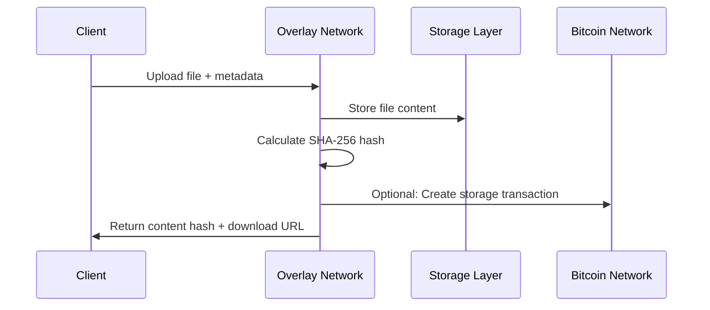

# BRC-26: File Storage (UHRP)

**Purpose**: Universal Hash Resolution Protocol for content-addressable file storage and retrieval

**Status**: ✅ Fully Implemented
**Compliance Level**: 96%
**Endpoints**:
- `POST /overlay/files/upload` - Upload files
- `GET /overlay/files/download/{hash}` - Download files
- `GET /overlay/files/resolve/{hash}` - Resolve content metadata

## 🎯 Overview

BRC-26 implements the Universal Hash Resolution Protocol (UHRP) for decentralized file storage on the BSV overlay network. Files are stored using SHA-256 content addressing, ensuring data integrity and enabling efficient deduplication across the network.

## 🔧 How It Works

### 1. Content Addressing

Every file is identified by its SHA-256 hash:

```javascript
const crypto = require('crypto');

function calculateContentHash(fileData) {
  return crypto.createHash('sha256').update(fileData).digest('hex');
}

// Example content hash
const contentHash = 'a665a45920422f9d417e4867efdc4fb8a04a1f3fff1fa07e998e86f7f7a27ae3';
```

### 2. File Upload Process



### 3. Upload File

```bash
curl -X POST "http://localhost:8788/overlay/files/upload" \
  -H "X-BSV-Identity: 0279be667ef9dcbbac55a06295ce870b07029bfcdb2dce28d959f2815b16f81798" \
  -F "file=@document.pdf" \
  -F "metadata={\"description\":\"Important document\",\"category\":\"legal\",\"tags\":[\"contract\",\"2024\"]}"
```

### 4. Download File

```bash
curl -X GET "http://localhost:8788/overlay/files/download/a665a45920422f9d417e4867efdc4fb8a04a1f3fff1fa07e998e86f7f7a27ae3" \
  -H "Accept: application/octet-stream" \
  -o downloaded-file.pdf
```

## 📤 File Upload

### Upload Request

```http
POST /overlay/files/upload HTTP/1.1
Host: localhost:8788
X-BSV-Identity: YOUR_PUBLIC_KEY
Content-Type: multipart/form-data

--boundary
Content-Disposition: form-data; name="file"; filename="example.json"
Content-Type: application/json

{"message": "Hello BSV Overlay Network!"}
--boundary
Content-Disposition: form-data; name="metadata"

{"description": "Example JSON file", "category": "demo"}
--boundary--
```

### Upload Parameters

| Parameter | Type | Required | Description |
|-----------|------|----------|-------------|
| `file` | file | ✅ | File content to upload |
| `metadata` | JSON string | ❌ | File metadata and tags |
| `encryption` | string | ❌ | Encryption method ('aes256', 'none') |
| `compress` | boolean | ❌ | Enable compression (default: true) |
| `ttl` | number | ❌ | Time to live in seconds |

### Metadata Structure

```typescript
interface FileMetadata {
  description?: string;           // Human-readable description
  category?: string;             // File category
  tags?: string[];              // Search tags
  contentType?: string;         // MIME type override
  author?: string;              // Content author
  license?: string;             // Content license
  created?: string;             // ISO 8601 creation date
  custom?: Record<string, any>; // Custom metadata fields
}
```

### Upload Success Response

```json
{
  "success": true,
  "contentHash": "a665a45920422f9d417e4867efdc4fb8a04a1f3fff1fa07e998e86f7f7a27ae3",
  "size": 1024,
  "contentType": "application/json",
  "downloadUrl": "/overlay/files/download/a665a45920422f9d417e4867efdc4fb8a04a1f3fff1fa07e998e86f7f7a27ae3",
  "resolveUrl": "/overlay/files/resolve/a665a45920422f9d417e4867efdc4fb8a04a1f3fff1fa07e998e86f7f7a27ae3",
  "metadata": {
    "description": "Example JSON file",
    "category": "demo",
    "uploadedAt": "2024-01-15T10:30:00Z",
    "uploader": "0279be667ef9dcbbac55a06295ce870b07029bfcdb2dce28d959f2815b16f81798"
  },
  "storage": {
    "replicas": 3,
    "availability": "99.9%",
    "region": "us-west"
  }
}
```

## 📥 File Download

### Download Request

```http
GET /overlay/files/download/a665a45920422f9d417e4867efdc4fb8a04a1f3fff1fa07e998e86f7f7a27ae3 HTTP/1.1
Host: localhost:8788
Accept: application/octet-stream
```

### Download Parameters (Query String)

| Parameter | Type | Description |
|-----------|------|-------------|
| `format` | string | Response format ('raw', 'base64', 'json') |
| `inline` | boolean | Serve inline vs attachment |
| `range` | string | Byte range for partial downloads |

### Download Success Response

```http
HTTP/1.1 200 OK
Content-Type: application/json
Content-Length: 1024
Content-Disposition: attachment; filename="example.json"
Content-Security-Policy: default-src 'none'
X-Content-Hash: a665a45920422f9d417e4867efdc4fb8a04a1f3fff1fa07e998e86f7f7a27ae3
X-Content-Verified: true

{"message": "Hello BSV Overlay Network!"}
```

### Streaming Download (Large Files)

```bash
# Download large files with progress
curl -X GET "http://localhost:8788/overlay/files/download/large-file-hash" \
  -H "Range: bytes=0-1048576" \
  -o partial-file.bin

# Resume interrupted downloads
curl -X GET "http://localhost:8788/overlay/files/download/large-file-hash" \
  -H "Range: bytes=1048577-" \
  -o partial-file.bin \
  --append-to-file
```

## 🔍 Content Resolution

### Resolve Request

```bash
curl -X GET "http://localhost:8788/overlay/files/resolve/a665a45920422f9d417e4867efdc4fb8a04a1f3fff1fa07e998e86f7f7a27ae3" \
  -H "Accept: application/json"
```

### Resolution Response

```json
{
  "success": true,
  "contentHash": "a665a45920422f9d417e4867efdc4fb8a04a1f3fff1fa07e998e86f7f7a27ae3",
  "exists": true,
  "metadata": {
    "size": 1024,
    "contentType": "application/json",
    "description": "Example JSON file",
    "category": "demo",
    "tags": ["example", "demo"],
    "uploadedAt": "2024-01-15T10:30:00Z",
    "uploader": "0279be667ef9dcbbac55a06295ce870b07029bfcdb2dce28d959f2815b16f81798",
    "lastAccessed": "2024-01-15T11:45:00Z",
    "accessCount": 15
  },
  "urls": {
    "download": "/overlay/files/download/a665a45920422f9d417e4867efdc4fb8a04a1f3fff1fa07e998e86f7f7a27ae3",
    "stream": "/overlay/files/stream/a665a45920422f9d417e4867efdc4fb8a04a1f3fff1fa07e998e86f7f7a27ae3",
    "cdn": "https://cdn.overlay.com/files/a665a45920422f9d417e4867efdc4fb8a04a1f3fff1fa07e998e86f7f7a27ae3"
  },
  "storage": {
    "replicas": 3,
    "locations": ["us-west-1", "eu-central-1", "asia-pacific-1"],
    "availability": "99.9%",
    "redundancy": "3-of-5"
  },
  "verification": {
    "hashVerified": true,
    "integrityCheck": "passed",
    "lastVerified": "2024-01-15T10:30:00Z"
  }
}
```

## ❌ Error Responses

### File Not Found (404)

```json
{
  "error": "file-not-found",
  "message": "Content hash not found in overlay network",
  "code": 404,
  "contentHash": "invalid-hash-example"
}
```

### Upload Too Large (413)

```json
{
  "error": "file-too-large",
  "message": "File size exceeds maximum limit of 100MB",
  "code": 413,
  "maxSize": 104857600,
  "receivedSize": 157286400
}
```

### Invalid Hash Format (400)

```json
{
  "error": "invalid-hash-format",
  "message": "Content hash must be 64-character hexadecimal string",
  "code": 400,
  "expectedFormat": "SHA-256 hex (64 chars)",
  "receivedHash": "invalid-hash"
}
```

### Storage Quota Exceeded (507)

```json
{
  "error": "storage-quota-exceeded",
  "message": "Storage quota exceeded for identity",
  "code": 507,
  "currentUsage": 1073741824,
  "quotaLimit": 1073741824,
  "upgradeUrl": "/overlay/storage/upgrade"
}
```

## 🔐 Authentication & Security

### Identity-Based Access Control

```http
X-BSV-Identity: 0279be667ef9dcbbac55a06295ce870b07029bfcdb2dce28d959f2815b16f81798
X-BSV-Signature: 304502210089abc...
```

### File Encryption

Upload encrypted files:

```javascript
const crypto = require('crypto');

// Generate encryption key
const encryptionKey = crypto.randomBytes(32);
const iv = crypto.randomBytes(16);

// Encrypt file content
const cipher = crypto.createCipher('aes-256-cbc', encryptionKey);
const encryptedContent = Buffer.concat([
  cipher.update(fileContent),
  cipher.final()
]);

// Upload with encryption metadata
const form = new FormData();
form.append('file', encryptedContent);
form.append('metadata', JSON.stringify({
  encryption: 'aes-256-cbc',
  keyHash: crypto.createHash('sha256').update(encryptionKey).digest('hex'),
  iv: iv.toString('hex')
}));
```

### Access Control Lists

```javascript
// Upload with access restrictions
const metadata = {
  description: 'Private document',
  accessControl: {
    type: 'whitelist',
    allowedIdentities: [
      '0279be667ef9dcbbac55a06295ce870b07029bfcdb2dce28d959f2815b16f81798',
      '03ba30b8949be9ad8b6c8f6e1c7d8e7f2a9b0c3d4e5f6789abcdef0123456789ab'
    ],
    expiration: '2024-12-31T23:59:59Z'
  }
};
```

## 🌐 Advanced Features

### Content Deduplication

Files with identical content share the same hash and storage:

```javascript
// Multiple uploads of same content
const file1Upload = await uploadFile('document.pdf', metadata1);
const file2Upload = await uploadFile('document.pdf', metadata2);

// Same content hash returned
console.log(file1Upload.contentHash === file2Upload.contentHash); // true

// Storage space saved through deduplication
console.log('Storage efficient:', file1Upload.storage.deduplicated); // true
```

### Multi-Format Support

```javascript
// Upload with format conversions
const metadata = {
  description: 'Multi-format document',
  conversions: {
    formats: ['pdf', 'html', 'txt'],
    quality: 'high',
    compression: true
  }
};

// Access different formats
const pdfUrl = `/overlay/files/download/${hash}?format=pdf`;
const htmlUrl = `/overlay/files/download/${hash}?format=html`;
const txtUrl = `/overlay/files/download/${hash}?format=txt`;
```

### Version Management

```javascript
// Upload new version
const versionMetadata = {
  description: 'Updated document',
  version: '2.0',
  previousVersion: 'previous-content-hash',
  changelog: 'Fixed formatting issues'
};

// Query version history
const versions = await lookupService.query('content-resolver', {
  versionHistory: originalHash,
  includeMetadata: true
});
```

## 🧪 Testing Examples

### JavaScript/Node.js

```javascript
const FormData = require('form-data');
const fs = require('fs');
const axios = require('axios');
const crypto = require('crypto');

class FileStorageService {
  constructor(baseUrl, identityKey) {
    this.baseUrl = baseUrl;
    this.identityKey = identityKey;
  }

  async uploadFile(filePath, metadata = {}) {
    const form = new FormData();
    form.append('file', fs.createReadStream(filePath));
    form.append('metadata', JSON.stringify(metadata));

    const response = await axios.post(`${this.baseUrl}/overlay/files/upload`, form, {
      headers: {
        ...form.getHeaders(),
        'X-BSV-Identity': this.identityKey
      }
    });

    return response.data;
  }

  async downloadFile(contentHash, outputPath = null) {
    const response = await axios.get(`${this.baseUrl}/overlay/files/download/${contentHash}`, {
      responseType: outputPath ? 'stream' : 'arraybuffer'
    });

    if (outputPath) {
      const writer = fs.createWriteStream(outputPath);
      response.data.pipe(writer);

      return new Promise((resolve, reject) => {
        writer.on('finish', () => resolve(outputPath));
        writer.on('error', reject);
      });
    }

    return response.data;
  }

  async resolveContent(contentHash) {
    const response = await axios.get(`${this.baseUrl}/overlay/files/resolve/${contentHash}`);
    return response.data;
  }

  calculateHash(filePath) {
    const content = fs.readFileSync(filePath);
    return crypto.createHash('sha256').update(content).digest('hex');
  }
}

// Usage example
const storage = new FileStorageService('http://localhost:8788', 'YOUR_IDENTITY_KEY');

async function demonstrateStorage() {
  // Upload a file
  const uploadResult = await storage.uploadFile('./test-file.json', {
    description: 'Test upload',
    category: 'demo',
    tags: ['test', 'example']
  });

  console.log('Uploaded:', uploadResult.contentHash);

  // Verify hash matches
  const calculatedHash = storage.calculateHash('./test-file.json');
  console.log('Hash verified:', uploadResult.contentHash === calculatedHash);

  // Download the file
  await storage.downloadFile(uploadResult.contentHash, './downloaded-file.json');

  // Resolve metadata
  const metadata = await storage.resolveContent(uploadResult.contentHash);
  console.log('File metadata:', metadata);
}
```

### Python

```python
import requests
import hashlib
import json
from pathlib import Path

class FileStorageService:
    def __init__(self, base_url, identity_key):
        self.base_url = base_url
        self.identity_key = identity_key

    def upload_file(self, file_path, metadata=None):
        with open(file_path, 'rb') as f:
            files = {'file': f}
            data = {}

            if metadata:
                data['metadata'] = json.dumps(metadata)

            headers = {'X-BSV-Identity': self.identity_key}

            response = requests.post(
                f"{self.base_url}/overlay/files/upload",
                files=files,
                data=data,
                headers=headers
            )

            return response.json()

    def download_file(self, content_hash, output_path=None):
        response = requests.get(
            f"{self.base_url}/overlay/files/download/{content_hash}",
            stream=True
        )

        if output_path:
            with open(output_path, 'wb') as f:
                for chunk in response.iter_content(chunk_size=8192):
                    f.write(chunk)
            return output_path

        return response.content

    def resolve_content(self, content_hash):
        response = requests.get(
            f"{self.base_url}/overlay/files/resolve/{content_hash}"
        )
        return response.json()

    def calculate_hash(self, file_path):
        sha256_hash = hashlib.sha256()
        with open(file_path, 'rb') as f:
            for chunk in iter(lambda: f.read(4096), b""):
                sha256_hash.update(chunk)
        return sha256_hash.hexdigest()

# Usage
storage = FileStorageService("http://localhost:8788", "YOUR_IDENTITY_KEY")

# Upload and verify
file_path = "test-document.pdf"
upload_result = storage.upload_file(file_path, {
    "description": "Important document",
    "category": "legal",
    "tags": ["contract", "2024"]
})

# Verify integrity
calculated_hash = storage.calculate_hash(file_path)
assert upload_result["contentHash"] == calculated_hash, "Hash mismatch!"

# Download and verify
downloaded_path = "downloaded-document.pdf"
storage.download_file(upload_result["contentHash"], downloaded_path)

# Check file sizes match
original_size = Path(file_path).stat().st_size
downloaded_size = Path(downloaded_path).stat().st_size
assert original_size == downloaded_size, "File size mismatch!"
```

## 🚀 Best Practices

### 1. Content Integrity

- Always verify downloaded content hashes
- Use checksums for large file transfers
- Implement retry logic for failed downloads
- Validate file formats before processing

### 2. Storage Optimization

- Compress files before upload when appropriate
- Use efficient file formats (WebP for images, WebM for video)
- Implement client-side deduplication
- Clean up temporary files after processing

### 3. Security

- Encrypt sensitive files before upload
- Use identity-based access controls
- Implement secure key management
- Audit file access patterns

### 4. Performance

- Use streaming for large files
- Implement parallel uploads for multiple files
- Cache frequently accessed content
- Use CDN endpoints for global distribution

## 🔗 Related Standards

- **BRC-22**: Submit file storage transactions
- **BRC-24**: Query file metadata and history
- **BRC-31**: Authenticate file access
- **BRC-41**: Pay for storage services
- **BRC-88**: Discover storage providers

## 📚 Additional Resources

- [UHRP Specification](../protocols/uhrp.md)
- [Content Addressing Guide](../content-addressing/)
- [File Encryption Best Practices](../security/encryption.md)
- [Storage Optimization Tips](../performance/storage.md)

---

**Next**: Learn about [BRC-31 Authentication](./BRC-31-Authentication.md) for secure identity verification.