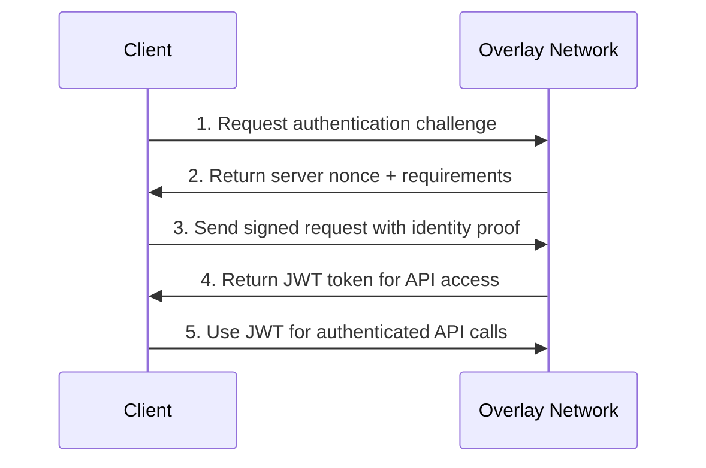
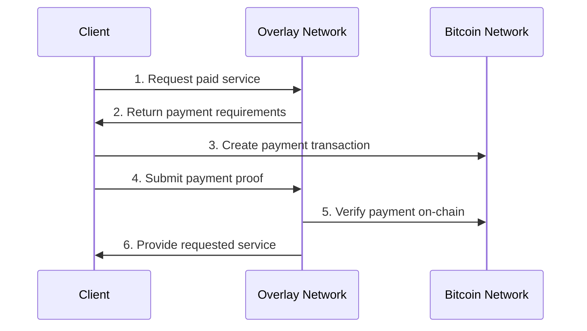

# 🚀 BSV Overlay Network Developer Guide

Welcome to the BSV Overlay Network - a production-ready platform for building distributed applications on Bitcoin SV with full BRC standards compliance.

## 🎯 What You'll Build

In this guide, you'll learn to:
- **Submit transactions** to the overlay network (BRC-22)
- **Store and retrieve files** using UHRP (BRC-26)
- **Authenticate identities** with BRC-31 Authrite
- **Process payments** with BRC-41 PacketPay
- **Stream content** with advanced transcoding and P2P distribution
- **Federate networks** for global content synchronization

## ⚡ 15-Minute Quick Start

### Prerequisites

```bash
# Required
- Node.js 18+ or Python 3.8+
- BSV wallet with testnet coins
- Basic understanding of Bitcoin transactions

# Optional for development
- Docker & Docker Compose
- PostgreSQL 14+
- Redis 6+
```

### Step 1: Environment Setup

```bash
# Clone the overlay network (if running your own node)
git clone https://github.com/your-org/bsv-overlay-network.git
cd bsv-overlay-network

# Configure environment
cp .env.example .env

# Edit .env with your settings:
# OVERLAY_ENABLED=true
# BSV_NETWORK=testnet
# PG_HOST=localhost
# PG_DATABASE=overlay
# REDIS_URL=redis://localhost:6379

# Or connect to existing network
export OVERLAY_BASE_URL=https://api.youroverlay.com
```

### Step 2: Start Services (Local Development)

```bash
# Start database and cache
docker-compose up -d postgres redis

# Initialize database schema
npm run setup:database

# Start the overlay network
npm run dev
# Server starts at http://localhost:8788
# API docs available at http://localhost:8788/docs
```

### Step 3: Generate Your Identity

```javascript
// Generate identity for BRC-31 authentication
const { PrivateKey } = require('@bsv/sdk');

const identityKey = PrivateKey.fromRandom();
const publicKey = identityKey.toPublicKey();

console.log('Identity Private Key:', identityKey.toString());
console.log('Identity Public Key:', publicKey.toString());

// Save these securely - you'll need them for API calls
```

### Step 4: Your First API Call

```bash
# Test overlay network status
curl -X GET "http://localhost:8788/overlay/status" \
  -H "Accept: application/json"

# Expected response:
# {
#   "enabled": true,
#   "connected": true,
#   "services": {
#     "brc22": "Transaction Submission",
#     "brc24": "Lookup Services",
#     "brc26": "File Storage (UHRP)",
#     "brc31": "Authentication",
#     "brc41": "Payment Processing"
#   }
# }
```

### Step 5: Upload Your First File

```bash
# Upload a test file to the overlay network
curl -X POST "http://localhost:8788/overlay/files/upload" \
  -H "X-BSV-Identity: YOUR_PUBLIC_KEY" \
  -F "file=@test-file.json" \
  -F "metadata={\"description\":\"My first overlay file\"}"

# Response includes content hash for retrieval:
# {
#   "success": true,
#   "contentHash": "a665a45920422f9d417e4867efdc4fb8a04a1f3fff1fa07e998e86f7f7a27ae3",
#   "downloadUrl": "/overlay/files/download/a665a45920422f9d417e4867efdc4fb8a04a1f3fff1fa07e998e86f7f7a27ae3"
# }
```

### Step 6: Download Your File

```bash
# Retrieve the uploaded file
curl -X GET "http://localhost:8788/overlay/files/download/a665a45920422f9d417e4867efdc4fb8a04a1f3fff1fa07e998e86f7f7a27ae3" \
  -H "Accept: application/octet-stream" \
  -o downloaded-file.json

# Verify it matches your original file
diff test-file.json downloaded-file.json
```

## 🏗️ Core Concepts

### BRC Standards Overview

| Standard | Purpose | Use Case |
|----------|---------|----------|
| **BRC-22** | Transaction Submission | Submit Bitcoin transactions to overlay topics |
| **BRC-24** | Lookup Services | Query overlay network state and history |
| **BRC-26** | File Storage (UHRP) | Store and retrieve files with content addressing |
| **BRC-31** | Authentication | Mutual authentication with identity verification |
| **BRC-41** | Payment Processing | HTTP micropayments for API access |
| **BRC-64** | History Tracking | Transaction lineage and provenance |
| **BRC-88** | Service Discovery | Find and advertise overlay services |

### Authentication Flow (BRC-31)



### Payment Flow (BRC-41)



## 🛠️ Development Patterns

### 1. Error Handling

All API endpoints return consistent error formats:

```json
{
  "error": "error-code",
  "message": "Human readable description",
  "code": 400,
  "details": {
    "field": "Additional error context"
  }
}
```

Common error codes:
- `overlay-unavailable` (503): Network not connected
- `invalid-identity` (401): Authentication failed
- `payment-required` (402): Service requires payment
- `rate-limit-exceeded` (429): Too many requests

### 2. Content Addressing

All files use SHA-256 content addressing:

```javascript
const crypto = require('crypto');

function getContentHash(fileData) {
  return crypto.createHash('sha256').update(fileData).digest('hex');
}

// Use hash for retrieval
const contentHash = getContentHash(myFileData);
const downloadUrl = `/overlay/files/download/${contentHash}`;
```

### 3. Topic-Based Organization

BRC-22 uses topics to organize overlay data:

```javascript
const topics = [
  'gitdata.manifest',           // File manifests
  'gitdata.agent.capabilities', // AI agent registrations
  'myapp.user.profiles',        // Custom application data
];

// Submit transaction to specific topics
const transaction = {
  rawTx: '0100000001...',
  inputs: [...],
  topics: topics
};
```

## 🔗 Next Steps

### Deep Dive Guides
- 📖 [BRC Standards Reference](../brc-standards/) - Detailed protocol specifications
- 🎬 [Streaming & Transcoding Guide](../streaming/) - Video processing and P2P distribution
- 🌐 [Federation Setup](../federation/) - Multi-network synchronization
- 💰 [Payment Integration](../payments/) - Monetize your overlay services

### Code Examples
- 🟨 [JavaScript/Node.js Examples](../examples/javascript/) - Complete integration examples
- 🐍 [Python Examples](../examples/python/) - SDK usage and best practices
- 🌐 [REST API Examples](../examples/curl/) - Raw HTTP API interactions

### Testing & Tools
- 📬 [Postman Collections](../../postman/) - Pre-built API test suites
- 🧪 [Integration Testing](../testing/) - Automated testing strategies
- 🔧 [CLI Tools](../tools/) - Command-line utilities

### Production Deployment
- 🐳 [Docker Deployment](../deployment/docker/) - Containerized overlay network
- ☁️ [Cloud Setup](../deployment/cloud/) - AWS, GCP, Azure configurations
- 📊 [Monitoring & Alerts](../monitoring/) - Production monitoring setup

## 🆘 Need Help?

- 📚 **Documentation**: Full API reference at `/docs`
- 🐛 **Issues**: Report bugs on GitHub
- 💬 **Community**: Join our developer Discord
- 📧 **Support**: enterprise@youroverlay.com

---

**🎉 Congratulations!** You've successfully connected to the BSV Overlay Network. Continue with the [BRC Standards Guide](../brc-standards/) to learn advanced features.
